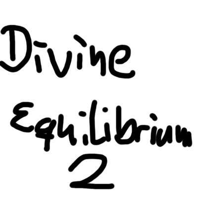

# Divine Equilibrium II

  

*An interdimensional Journey* • [CurseForge](https://www.curseforge.com/minecraft/modpacks/divine-equilibrium) • [Changelog](CHANGELOG.md) • [Bugtracker](https://github.com/MasterEnderman/DivineEquilibrium2/issues)

&nbsp;

## Story ##

Where am I? I uh... this uh... this can't be good. This can't be good at all. Why is it so dark? I'm not even quite sure which way is up. Okay... I need to think back to this morning to try and figure out how I got here. Let's see now... my alarm woke me up at 7:00 a.m., I got up, took a shower, got dressed, brushed my teeth and went on my daily walk to work. Actually wait, before I left for work I grabbed a potato to eat on my lunch break.

Hmm.. i'm really hungry now, where did my potato go? I don't remember ever eating it, and it doesn't seem to be in my pockets. Where is my potato? =(

## Pack-Developer

`_MasterEnderman_` - Project-Manager, Lead-Artist, Developer

[♥ Socials](https://ender.bio.link)
